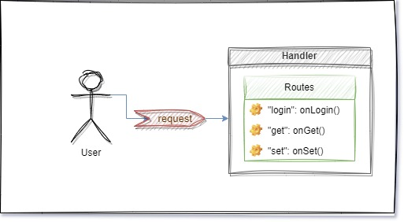

# Handler Lib
The *handler* module defines the handlers.
The handler is responsible for routing the requests to the user-defined functions.

*Diagram available on [Source](https://drive.google.com/file/d/1B0JOWbrbby9yUy66pMwWnlf8ic18XOs-/view?usp=sharing)*

There are different types of the handlers. 
Each type applies a certain behavior to the collection of the routes.

**SyncReplier** handles one request from multiple users at a time. 
The requests are queued while one request is processing.
**Replier** handles many requests from multiple users at a time.
It's a *server* part of classic *client-server* architecture.
The **Replier** may run multiple instances running on parallel threads. However, it's managed by the service, so don't worry about it.
Just remember that if more requests are coming, then the **Replier** tries to use more CPU cores.
**Publisher** is submits the message from the handler to the connected users. The **publisher** is the trigger-able handler.
Like that, it has two endpoints. One is for users to subscribe, another endpoint to trigger the broadcasting.
Usually, the trigger will be called by the handler function in another handler route.
**Pusher** submits the message from the handler to the connected users. If multiple users are connected,
then requests will be submitted in a round-robin algorithm.

> **Glossary**
> 
> *Notice we have two terms for **handler &ndash; user interaction**:*
> 
> **Request** &ndash; sender (user or handler) expects a reply from the destination (user or handler).
> 
> **Submit** &ndash; a message sent to the destination doesn't expect a reply. 
> It's fast; however, the sender doesn't know message delivery.

The primary definition of the handler is written in the `base` package. 
It's composed of the `Handler` structure and `Interface` of the `Handler`.
The `base` not supposed to be used by itself. Use the derived handlers.

To check the derived handlers against the validness, the `base.Interface` shall be used.

# Internal structure

## Route
The primary definition of handler calls from the outside
is defined in the *route* directory.
The *route* is composed of three parts.
The first part is the `command`.
The second part is the handle function.
Optionally, the third part which is the list of dependencies.

## Config
Just like anything in the SDS, the handlers are prepared
based on the configuration. The handler configuration
is stored in the *config* directory.

The `handler` file describes the handler's configuration.

The `handler_type` file describes the type of the handlers.

The `internal` file keeps the socket addresses of the various handler parts.

## Parts
The handler is split to various parts, each running in parallel.

By convention in SDS, the parts are running using `Run` function.
However, the `handler` is not running itself. It starts.
And when the handler starts, it runs the internal parts.

### Instance manager
Instance manager is the thread that manages the instances.

The operations to manage the instances are the direct methods:
* `AddInstance`
* `DeleteInstance`

However, these operations are asynchronous.
Therefore, the call of the methods doesn't indicate the operation was successful.

There is an option to check for the operation status.

The instance manager exposes two types of the sockets.
One is the puller, and another one is the publisher.

The threads that work with instances must subscribe for the events.

The puller is receiving the messages from the instances.
The instances are pushing the notifications about being their status.

When the puller receives the message, it broadcasts
it to the publisher socket as well.

### Instance
Instances are the threads that keep the routes and handle functions.
For any incoming requests by the route, the instances are calling the handle functions.

Instances have two sockets. The first socket is
to manage the instance. The second socket is to
receive a route.

### Instance and Instance Manager relationship
The instances are creating a pusher socket connected to the instance manager's puller socket.

The instance managers are creating two client sockets.
The one client is connected to the handler of the instance.
Another client is connected to the manager of the instance.

> The instance handler client and instance manager client
> are passed from instance manager to other threads.

### Reactor
The *reactor* package defines the external socket.
This package depends on the *instance_manager*.

The reactor exposes an `external` socket.
The messages that the handler has to receive are accepted by `external` socket.
The reactor keeps all incoming messages in the internal `queue`.
It also has the `consumer` that checks the `queue` in **every millisecond**.
Consumer forwards the messages to the ready instances.

### Manager
The last package is located in `handler_manager` directory.
The handler manager is the only way how the external sockets
can manage the handler.

---

Even though the zeromq sockets are not thread safe.
The instance manager, reactor or handler manager are not closing the sockets.
They send the signal to the responsible thread that closes the sockets.