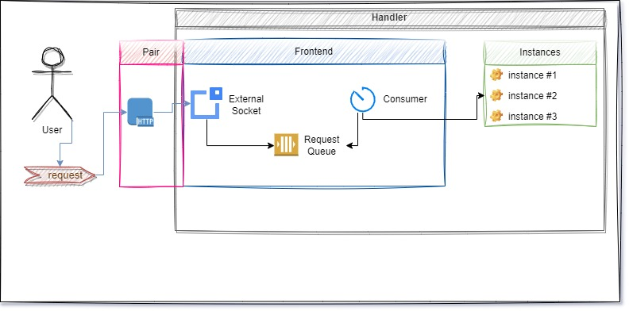

# Handler Lib
The handler is responsible for routing the requests to the user-defined functions.

*Diagram available on [Source](https://drive.google.com/file/d/1B0JOWbrbby9yUy66pMwWnlf8ic18XOs-/view?usp=sharing)*

There are different types of the handlers. 
Each type applies a certain behavior to the collection of the routes.

**SyncReplier** handles one request from per user at a time. 
The requests are queued while one request is processing.

**Replier** handles many requests from multiple users at a time.
It's a *server* part of classic *client-server* architecture.
The **Replier** may run multiple instances running on parallel threads. However, it's managed by the service, so don't worry about it.
Just remember that if more requests are coming, then the **Replier** tries to use more CPU cores.

**Publisher** broadcasts the message from the handler to the connected users. 
The **publisher** is the trigger-able handler.
Like that, it has two endpoints. One is for users to subscribe, another endpoint to trigger publishing.
Usually, the trigger will be called by the handler function in another handler function.

**Pusher** submits the message from the handler to the connected users. If multiple users are connected,
then requests will be submitted in a round-robin algorithm.

> **Glossary**
> 
> *Notice we have two terms for **handler &ndash; user interaction**:*
> 
> **Send** &ndash; a handler user interaction.
> 
> **Request** &ndash; sender (user or handler) expects a reply from the destination (user or handler).
> 
> **Submit** &ndash; a message sent to the destination doesn't expect a reply. 
> It's fast; however, the sender doesn't know message delivery.

The primary definition of the handler is written in the `base` package. 
It's composed of the `Handler` structure and `Interface` of the `Handler`.
The `base` not supposed to be used by itself. Use the derived handlers.

To check the derived handlers against the validness, the `base.Interface` shall be used.

# Internal structure

## Route
The route defines the user request.
It's composed of three parts.
The first part is the `command`.
The second part is the handle function.
The third part, which is optional, is the list services that handle function will call.

## Config
Just like anything in the SDS, the handlers are prepared
based on the configuration. The handler configuration
is stored in the *config* package.

The `handler` file describes the handler's configuration.

The `handler_type` file describes the type of the handlers. Remember `SyncReplier`, `Replier`?

The `internal` file keeps the socket addresses of the various handler parts.

## Parts
The handler is split to various parts.
Each part is a parallel thread.

### Instance manager
Instance manager is the thread that manages the instances.

The operations to manage the instances are the direct methods:
* `AddInstance`
* `DeleteInstance`

However, these operations are asynchronous.
Therefore, the call of the methods doesn't indicate the operation was successful.

The instance manager exposes two types of the sockets.
One is the puller, and another one is the publisher.

The threads that work with instance manager must subscribe for the events.
There is an option to check for the operation status.

The puller is receiving the messages from the instances.
The instances are pushing the notifications about being their status.

When the puller receives the message, it broadcasts
it to the publisher socket as well.

### Instance
Instances are the threads that keep the routes and handle functions.
For any incoming requests by the route, the instances are calling the handle functions.

Instances have two sockets. The first socket is
to manage the instance. The second socket is to
receive a user request.

#### Instance and Instance Manager relationship
The instances are creating a pusher socket connected to the instance manager's puller socket.

The instance managers are creating two client sockets.
The one client is connected to the handler of the instance.
Another client is connected to the manager of the instance.

> The instance handler client and instance manager client
> are passed from instance manager to other threads.

### Frontend
The **frontend** package defines the external socket that receives data from users.
This package depends on the *instance_manager*.

The frontend exposes an `external` socket.
The messages that the handler has to receive are accepted by `external` socket.
The frontend keeps all incoming messages in the internal `queue`.
It also has the `consumer` that checks the `queue` as fast as it could.
Consumer forwards the messages to the ready instances.

### Manager
The last part is a `handler_manager` package.
The handler manager is the only way how the external sockets
can manage the handler parts such as instances, frontend.

---

Even though the zeromq sockets are not thread safe.
The instance manager, frontend or handler manager are not closing the sockets.
They send the signal to the responsible thread that closes the sockets.

### Recap
* instance manager
* handler manager
* frontend
* instance

## Overwriting
The aspects of the handlers are over-writable.
However, it won't over-write the part. 
For each part, it could change some aspects.
Usually, there are two cases when over-writing is necessary.
The first case is when you write the custom handler.
The second case is services will over-write some parts of the handler.

Here are the aspects of each part for over-writing.

### Handler Manager
You may over-write the routes that manage the handler.
However, it doesn't support adding a new route.

### Frontend
The Over-writing happens to the external socket only.
The over-writing means a set-up of the new layer then pair it to the frontend.

*Diagram available on [Source](https://drive.google.com/file/d/1B0JOWbrbby9yUy66pMwWnlf8ic18XOs-/view?usp=sharing)*

As seen in the diagram, user requests go to the frontend through a paired socket.

Create a server that has infinite loop.
Use the `config.Handler` parameters to occupy a port.
Then, get the `pair.Client`.
When a server receives a request, submit the request to the client.
Client will send it to the external service.

The pair client is available from `handler.Frontend.PairClient`.
In order to enable the pair client, you must return call `handler.Frontend.PairExternal()`
This function is available only after setting up the configuration.

Then, create a pair.Client().
For any request that comes in your server,
pass them to the pair.

There are two available functions as well:
`PairConfig` and `PairClient`.

Use the configuration for creating your own protocol.
And the pair client in the protocol, to forward a message to the handler's frontend.

Example is implemented in [web-lib](https://github.com/ahmetson/web-lib) &ndash; a support of the HTTP protocol.

### Instance Manager
In instance manager, it's possible to change the message type.
Any message has to implement two interfaces
`message.RequestInterface` and `message.ReplyInterface`.

By default, the messages are parsed as `message.Request` and `message.Reply`